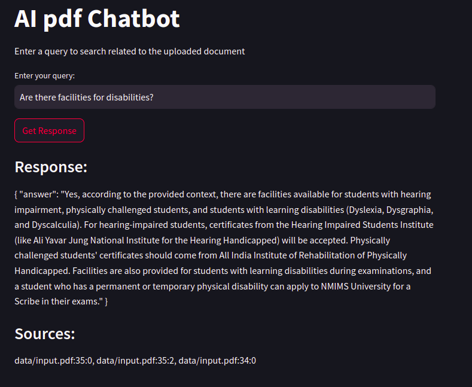

# AI PDF Chatbot 

## Demo Video
Watch the demo video here: [demo.mp4](./Demo.mp4)

## Model Configuration
- **Model**: Mistral model from **Ollama** for generating responses.
- **Embedding**: Custom function for converting document content into embeddings for similarity searches.

## Setup Instructions

### 1. Create a Virtual Environment
```bash
python3.10 -m venv venv
source venv/bin/activate
```

### 2. Install Dependencies
```bash
pip install -r requirements.txt
```

### 3. Key Dependencies
- **Streamlit**: Interactive web interface.
- **Langchain**: Document processing.
- **Chroma**: Vector database for embeddings.
- **Ollama**: Mistral model for response generation.
- **Python** 
- **SQLite**


### 4. Check SQLite Version
```bash
sqlite3 --version
```
**Note**: Ensure SQLite version >35 for compatibility with `pysqlite3`. Upgrade if necessary.

### 5. Run the populate_database.py  to check whether the documents uploaded successfully or not
```bash
python populate_database.py
```
### 6. Model Initialization

This application uses the **Mistral** and **Nomic-Embed-Text** models from Ollama for generating responses. Before running the application for the first time, ensure the required models are pulled using the following bash commands:

#### Pulling Models Manually
If prompted during the first execution, you can manually pull the models using the following commands:

```bash
# Pull the Mistral model
ollama pull mistral

# Pull the Nomic-Embed-Text model
ollama pull nomic-embed-text
```

### 7. Adding the documents
please add the input document(.pdf) whatever you want into give as input, in the `data` folder

### 8. Run the Application
```bash
streamlit run query_app.py
```

### 9. Using the Chatbot
Open the APP in your local browser.Type a query in the input box, and the chatbot will return relevant answers from the uploaded documents.

## **Response and Source**

- **Response**: The answer generated by the chatbot based on the query, derived from the relevant documents.
- **Source**: The document(s)(page No.) from which the information was retrieved, helping to track the origin of the response.
- If an empty response occurs, click **"Get Response"** again.


## Example



